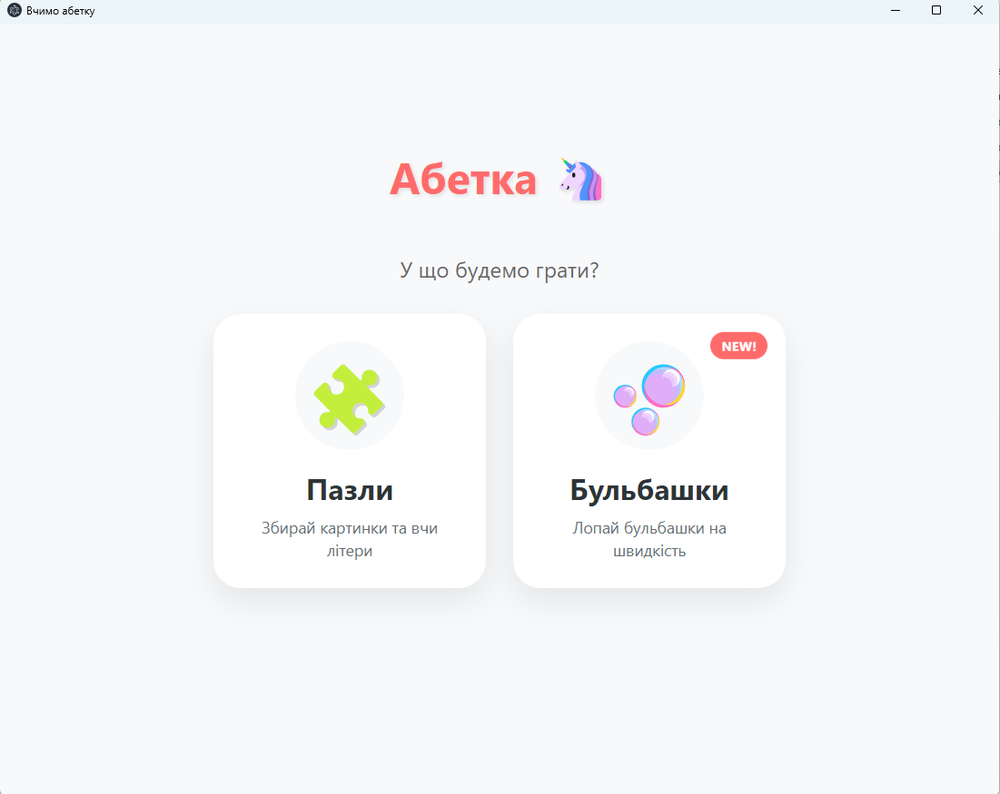
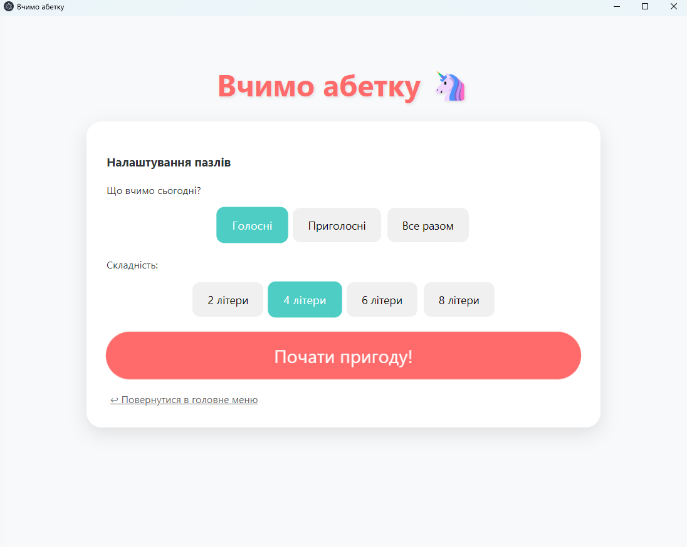
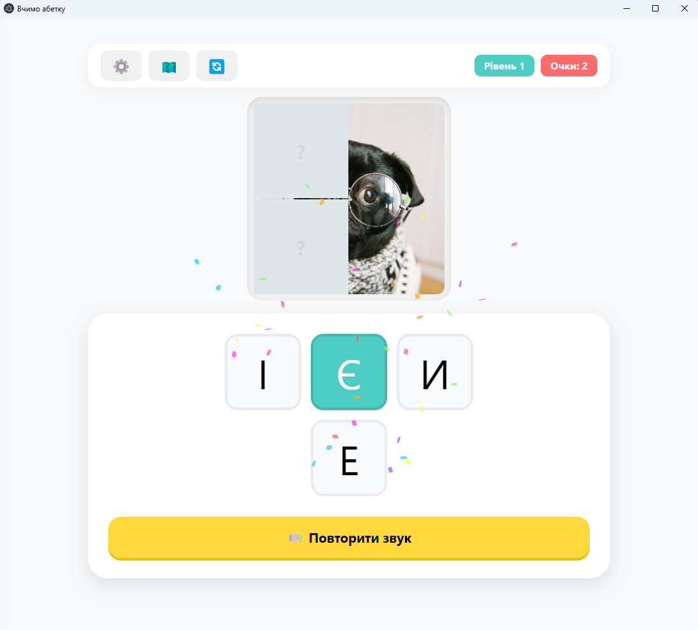
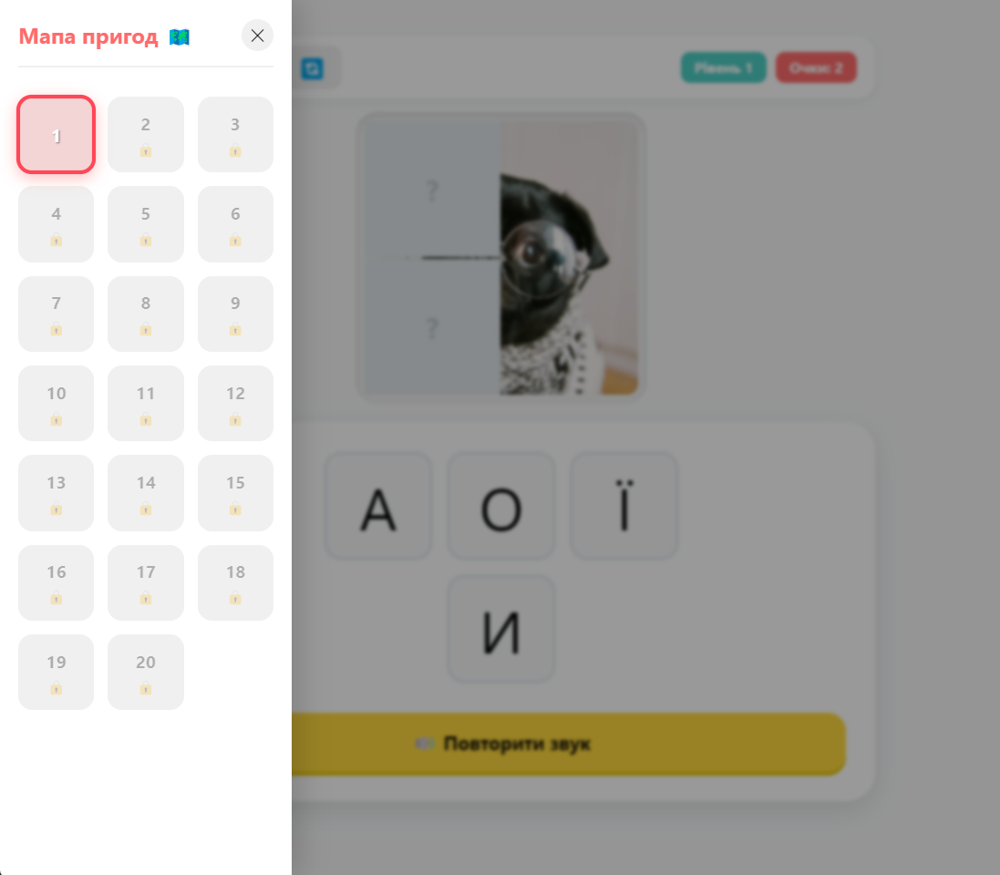
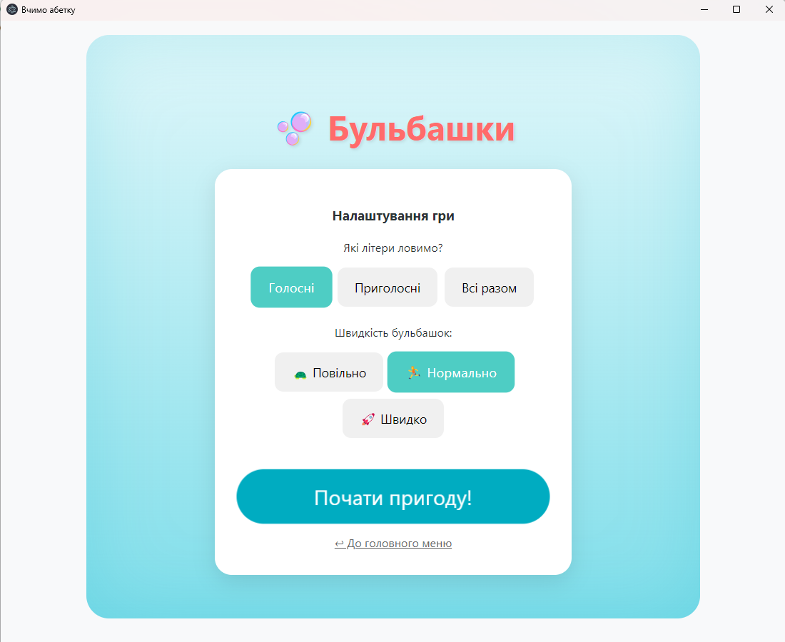
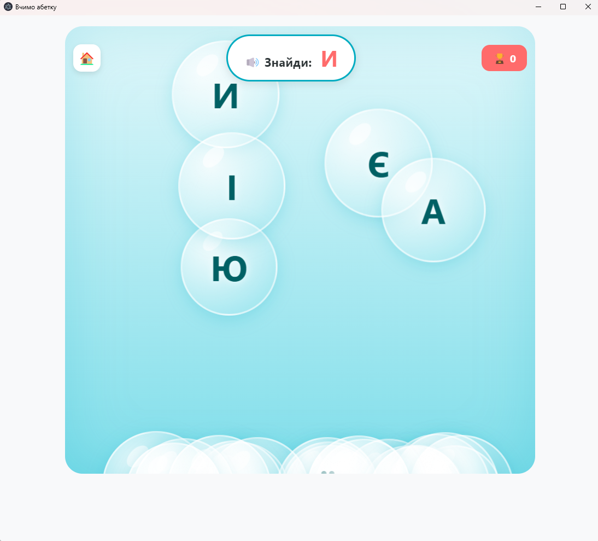

# Пакунок дитячих ігор - "Абетка"

Інтерактивна дитяча гра для вивчення української абетки з озвученням і візуальними мінііграми.

Проєкт містить два ігрові режими:
- `Пазли`: відгадування букв із поступовим відкриттям зображення.
- `Бульбашки`: пошук потрібної букви серед спливних бульбашок.

Гра працює як вебзастосунок, PWA і десктоп-застосунок через Electron.

## Скріншоти

### 1) Головна



### 2) Пазли - екран входу



### 3) Пазли - 1 рівень



### 4) Пазли - мапа пригод



### 5) Бульбашки - старт



### 6) Бульбашки - ігрове поле



## Що реалізовано

- Вивчення букв української абетки (голосні, приголосні, змішаний режим).
- Озвучення букв і фраз підтримки.
- Прогресія рівнів у пазлах (до 20 рівнів).
- Збереження прогресу пазлів у `localStorage`.
- Ефекти перемоги через `canvas-confetti`.

## Ігрові механіки

### 1) Пазли

- Вибір режиму навчання: голосні/приголосні/усі букви.
- Вибір складності: кількість варіантів відповіді (`2`, `4`, `6`, `8`).
- За правильну відповідь:
  - збільшується рахунок;
  - відкривається випадковий фрагмент пазла;
  - відтворюється фраза похвали.
- За помилку:
  - позначається неправильний варіант;
  - може сховатися один уже відкритий фрагмент (не більше одного штрафу за раунд);
  - відтворюється фраза підказки.
- Після відкриття всіх фрагментів рівня запускається святкова анімація і стає доступним перехід на наступний рівень.

### 2) Бульбашки

- Перед стартом обираються:
  - набір букв (голосні/приголосні/усі);
  - швидкість (`slow`, `normal`, `fast`).
- Гра озвучує цільову букву, гравець лопає правильні бульбашки.
- За правильну бульбашку нараховуються очки та обирається нова ціль.
- Неправильна бульбашка перетворюється на "камінь" і падає.

## Архітектура проєкту

- `src/App.tsx` - навігація між головним меню та мінііграми.
- `src/components/MainMenu.tsx` - головне меню.
- `src/components/PuzzleGame.tsx` - режим пазлів, логіка рівнів і прогресу.
- `src/components/BubbleGame.tsx` - режим бульбашок.
- `src/data/letters.ts` - набори букв, озвучення, резервний `SpeechSynthesis`.
- `electron/main.cjs` - вікно Electron і запуск десктоп-версії.
- `electron/preload.cjs` - preload-скрипт (поки заглушка).
- `scripts/generate_audio.js` - генерація/завантаження озвучення.
- `scripts/download_puzzles.js` - завантаження зображень для пазлів.

## Вимоги

- Node.js 18+ (рекомендована актуальна LTS-версія).
- npm (встановлюється разом із Node.js).

## Запуск і збірка

Встановлення залежностей:

```bash
npm install
```

Запуск у режимі розробки (web):

```bash
npm run dev
```

Збірка web-версії:

```bash
npm run build
```

Попередній перегляд production-збірки:

```bash
npm run preview
```

Запуск Electron у розробці:

```bash
npm run electron:dev
```

Збірка Electron-пакета:

```bash
npm run electron:build
```

## Аудіо та зображення

Очікувані ресурси:
- `public/audio/*.mp3` - букви та службові звуки (`praise_*.mp3`, `error_*.mp3`).
- `public/images/puzzles/*.jpg` - зображення рівнів (зазвичай `1.jpg` ... `20.jpg`).

Важливо для Electron: використовуються відносні шляхи `./audio/...` і `./images/...`.

Якщо mp3 недоступний, застосовується резервне озвучення через `SpeechSynthesis` (`uk-UA`).

## PWA

Проєкт налаштовано через `vite-plugin-pwa`:
- автооновлення service worker;
- маніфест застосунку;
- кешування статичних ресурсів.

## Збереження прогресу

Пазли зберігають стан у `localStorage` за ключем:

- `ABETKA_GAME_PROGRESS`

Зберігаються рівень, очки, відкриті фрагменти, обраний режим і складність.

## Технології

- React 18 + TypeScript
- Vite 5
- Electron 29
- vite-plugin-pwa
- canvas-confetti

## Ліцензія

Ліцензія у репозиторії не задана. За потреби додайте файл `LICENSE`.
